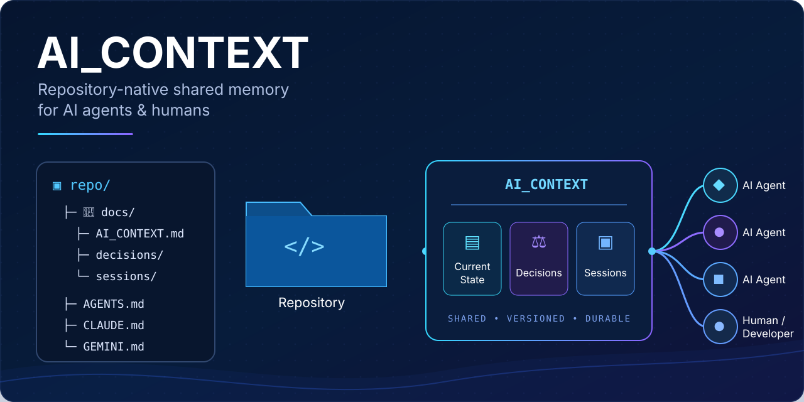

# AI_CONTEXT

<p align="center">
  
</p>

**Repository-native shared memory for AI coding agents.**

AI_CONTEXT is a lightweight, vendor-neutral pattern for preserving the engineering context that normally gets trapped inside one AI chat, one coding agent, or one context window.

The idea is simple:

> Put the important project memory in the repository, then let every AI agent read and maintain the same source of truth.

Instead of depending on a particular model's conversation history, AI_CONTEXT stores concise, durable project knowledge alongside the code:

```text
project/
├── AGENTS.md / CLAUDE.md / GEMINI.md   # Agent-specific entry point
└── docs/
    ├── AI_CONTEXT.md                   # Current project state
    ├── decisions/                      # Durable design decisions
    └── sessions/                       # Useful development handoffs
```

The result is a practical bridge between Codex, Claude Code, Gemini CLI, other coding agents, human developers, and future sessions that have never seen the original conversation.

### This repository uses AI_CONTEXT itself

AI_CONTEXT is intentionally **dogfooding its own convention**. The generic files under `templates/` and `examples/` teach other projects how to adopt the pattern, while this repository's own live shared memory is maintained in:

- [`AGENTS.md`](AGENTS.md) — project-specific agent instructions;
- [`docs/AI_CONTEXT.md`](docs/AI_CONTEXT.md) — the current state of AI_CONTEXT itself;
- [`docs/decisions/`](docs/decisions/) — real decisions made while evolving the project;
- [`docs/sessions/`](docs/sessions/) — real development handoffs for future agents and contributors.

That makes this repository both the reference material **and a working example**. The first decision record documents why the project chose to self-host the pattern: [`0001-dogfood-ai-context.md`](docs/decisions/0001-dogfood-ai-context.md).

---

## The problem

AI coding agents are increasingly capable of working for long periods on real repositories, but their conversational memory is not the repository's memory.

Important context can disappear when:

- a context window is compacted or exhausted;
- a new chat or agent session is started;
- work moves from one AI product to another;
- another developer or agent takes over;
- a conversation contains the reason for a decision, but the code only contains the result;
- an experiment failed in chat and a future agent unknowingly repeats it.

Source code answers **what exists**. It often does not answer **why it exists, what was tried, what is currently broken, or what should happen next**.

AI_CONTEXT externalizes that missing layer into ordinary Markdown tracked with the project.

---

## The core idea

AI_CONTEXT separates project memory into three kinds of information.

### 1. Current state — `docs/AI_CONTEXT.md`

A short, living handoff document describing the project **as it exists now**.

It should answer:

- What are we building?
- What is the current architecture?
- What works?
- What is broken or unfinished?
- What changed recently?
- What is being worked on now?
- What should happen next?
- Which files matter most?

It is **not** a chronological diary. Keep it concise and rewrite stale sections as the project changes.

### 2. Durable decisions — `docs/decisions/`

Important architectural or design choices deserve a permanent explanation.

Each decision record captures:

- the problem;
- the chosen approach;
- alternatives considered;
- rationale;
- consequences and tradeoffs.

This follows the well-established Architecture Decision Record (ADR) idea, adapted for AI-assisted development.

### 3. Session handoffs — `docs/sessions/`

Session journals preserve useful continuity from substantial work that does not belong in the permanent current-state document.

A good session record can capture:

- the user's or team's goal;
- what was investigated;
- meaningful discoveries;
- changes made;
- tests and results;
- failed approaches worth remembering;
- unresolved issues;
- the state in which the project was left.

Session journals should be created for meaningful work, **not every chat or tiny edit**.

---

## Why not just save the whole AI chat?

Because raw chat history is usually the wrong abstraction for long-term engineering memory.

Raw transcripts are noisy, repetitive, expensive to reload into context, full of temporary speculation, likely to contain irrelevant tool output, potentially sensitive, tied to one product's conversation format, and poor at distinguishing current truth from ideas that were later rejected.

AI_CONTEXT stores the **engineering result of the conversation**, not a transcript of it.

Record conclusions, requirements, constraints, tradeoffs, experiments, failures, test results, and decisions.

Do **not** attempt to store hidden chain-of-thought or private internal reasoning traces.

---

## Recommended authority order

When sources disagree, a useful default is:

```text
1. Current code, configuration, tests, and observable runtime behavior
2. Accepted decision records
3. docs/AI_CONTEXT.md
4. Recent relevant session journals
5. Remembered or summarized chat context
```

Project-specific rules can override this, but explicitly defining an authority order prevents stale notes from silently becoming truth.

---

## Agent-neutral by design

The shared memory files are intentionally independent of the tool that reads them.

Different agents can use their native project instruction mechanism as a thin adapter into the same context:

| Agent / tool | Typical repository entry point | Role in AI_CONTEXT |
| --- | --- | --- |
| OpenAI Codex | `AGENTS.md` | Tell Codex to read and maintain the shared context |
| Claude Code | `CLAUDE.md` | Point Claude at the same shared context and rules |
| Gemini CLI | `GEMINI.md` | Point Gemini at the same shared context and rules |
| Other agents | Native instructions or initial prompt | Read the same `docs/` memory layer |
| Humans | README + Markdown | Read and edit the exact same project memory |

The adapter file should remain small. The durable knowledge belongs in the shared files, not duplicated separately for each AI product.

Gemini CLI can also be configured to load alternate context filenames such as `AGENTS.md`, which can reduce adapter duplication in mixed-agent repositories.

---

## Quick start

Copy the templates from this repository into an existing project:

```text
project/
├── AGENTS.md                 # or another native agent entry point
└── docs/
    ├── AI_CONTEXT.md
    ├── decisions/
    │   └── 0001-example.md
    └── sessions/
        └── YYYY-MM-DD-topic.md
```

Start with the files in [`templates/`](templates/), then add the appropriate adapter from [`examples/`](examples/).

The most important instruction is roughly:

```md
Before substantial work, read `docs/AI_CONTEXT.md` and any relevant
accepted decisions or recent session handoffs.

After substantial work, update those files when the project state,
important decisions, or useful continuation context changed.
```

That small feedback loop is the heart of the pattern.

---

## Suggested workflow

### At the start of substantial work

1. Read the agent's repository instruction file.
2. Read `docs/AI_CONTEXT.md`.
3. Read relevant accepted decisions.
4. Inspect recent session journals if prior debugging or experimentation matters.
5. Inspect the actual repository before trusting documentation blindly.

### During work

- Treat the code and tests as the source of observable truth.
- Preserve important user or product constraints.
- Record meaningful failed experiments instead of letting future agents rediscover them.
- Create a decision record when a choice will matter beyond the current task.

### Before finishing

1. Run relevant validation and tests.
2. Update `AI_CONTEXT.md` if current state changed.
3. Add or update a session handoff if future continuation would benefit.
4. Add an ADR if a durable design decision was made.
5. Remove stale information instead of endlessly appending to the context file.
6. Commit context changes alongside the code they describe whenever practical.

### After context loss or in a brand-new session

A fresh agent should be able to reconstruct the project by reading the repository rather than asking a human to retell the whole history.

A useful recovery instruction is:

```text
Read the repository instructions, docs/AI_CONTEXT.md, relevant decisions,
and recent session notes. Inspect the current code and Git state, then
reconstruct what has already been completed, what remains unresolved, and
what the next logical step is before making changes.
```

---

## What belongs in shared context?

Good candidates include project goals and non-obvious requirements, architectural boundaries, important invariants, compatibility requirements, deployment assumptions that materially affect development, accepted design decisions, known bugs and limitations, significant test results, failed approaches likely to be attempted again, migration state, active work and next steps, important file locations, and stakeholder requirements that directly affect the project.

Poor candidates include secrets or credentials, API keys and tokens, unrelated personal information, raw model chain-of-thought, full chat transcripts, every shell command ever run, obvious facts already clear from the code, speculative ideas that were never adopted, and huge pasted logs that can be stored elsewhere and referenced instead.

---

## Security and privacy

A Git repository is a durable publishing and replication mechanism. Treat context files accordingly.

**Never place secrets in shared AI context.**

Avoid committing passwords, private keys, bearer tokens, API credentials, private customer data, sensitive personal information, or confidential conversation content that does not belong in source control.

For private machine-specific memory, use a local ignored file or the agent's private/user-level memory mechanism rather than the shared repository layer.

A useful rule is:

> If it would be unsafe in the repository's README, it is probably unsafe in `AI_CONTEXT.md`.

---

## Keep context bounded

More context is not automatically better context.

A good `AI_CONTEXT.md` should be a **high-signal briefing**, not an archive.

Prefer concise summaries, links to deeper records, current facts, explicit uncertainty, dated session records for historical detail, and one decision per ADR.

Avoid allowing `AI_CONTEXT.md` to grow forever. When something becomes historical, move the durable rationale into a decision record or leave the detail in a session journal and shorten the current-state summary.

---

## Example

Imagine Agent A spends two hours debugging an authentication problem and discovers that requests fail because discovery and message calls use different credential paths.

Without shared context:

```text
Agent A chat ends
      ↓
reasoning disappears
      ↓
Agent B starts later
      ↓
repeats the same investigation
```

With AI_CONTEXT:

```text
Agent A
  ├─ fixes code
  ├─ updates AI_CONTEXT.md
  ├─ records the authentication decision
  └─ leaves a session handoff
             ↓
          Git repo
             ↓
      ┌──────┴──────┐
   Agent B         Human
      ↓               ↓
continues from      understands
known state         why it works
```

The repository becomes the continuity layer.

---

## Repository contents

- [`templates/AI_CONTEXT.md`](templates/AI_CONTEXT.md) — living project-state template
- [`templates/SESSION.md`](templates/SESSION.md) — substantial-work handoff template
- [`templates/ADR.md`](templates/ADR.md) — lightweight decision-record template
- [`examples/AGENTS.md`](examples/AGENTS.md) — Codex / AGENTS-style adapter
- [`examples/CLAUDE.md`](examples/CLAUDE.md) — Claude Code adapter
- [`examples/GEMINI.md`](examples/GEMINI.md) — Gemini CLI adapter
- [`docs/ADOPTION.md`](docs/ADOPTION.md) — guidance for introducing the pattern to an existing project
- [`docs/AI_CONTEXT.md`](docs/AI_CONTEXT.md) — this repository's live current-state context
- [`docs/decisions/`](docs/decisions/) — this repository's real durable decisions
- [`docs/sessions/`](docs/sessions/) — this repository's real development handoffs

---

## Design principles

AI_CONTEXT is intentionally boring technology:

1. **Plain Markdown** — readable by humans and models.
2. **Git-native** — versioned with the work it explains.
3. **Vendor-neutral** — no dependency on a specific model or API.
4. **Curated, not transcript-based** — preserve useful engineering knowledge, not conversational noise.
5. **Layered** — current state, durable decisions, and historical handoffs serve different purposes.
6. **Recoverable** — a new agent should be able to continue after context loss.
7. **Auditable** — changes to project memory are reviewable like code.
8. **Bounded** — important context stays small enough to remain useful.
9. **Security-aware** — shared memory is not a secret store.
10. **Human-compatible** — the documentation remains useful even if no AI agent is involved.

---

## Existing ideas this builds on

AI_CONTEXT combines several established practices rather than inventing a proprietary memory format: repository instruction files used by modern coding agents, Architecture Decision Records (ADRs), developer handoff notes, engineering journals, and docs-as-code.

Useful references:

- OpenAI Codex: https://developers.openai.com/codex/
- Claude Code: https://code.claude.com/docs/en/overview
- Gemini CLI context files: https://github.com/google-gemini/gemini-cli/blob/main/docs/cli/gemini-md.md
- Architecture Decision Records: https://adr.github.io/

---

## Status

This repository currently defines a **convention and reusable template**, not a formal protocol or standard.

That is intentional. The first goal is to make the pattern easy to understand, copy, test, and improve across real projects.

Potential future additions include a small initializer CLI, validation/linting for context files, stale-context detection, automatic context-size checks, adapters for additional agents and IDEs, optional machine-readable metadata, and GitHub Actions that verify required sections and broken links.

Contributions and real-world examples are welcome.

---

## A one-sentence definition

> **AI_CONTEXT is a repository-native shared memory pattern that lets humans and different AI agents preserve and recover the current state, important decisions, and useful development history of a project without relying on any single chat session.**
